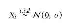
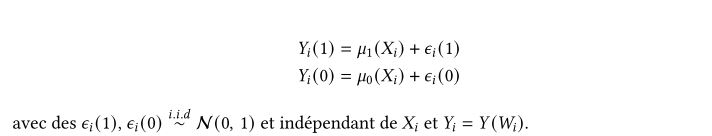
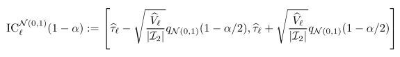
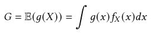
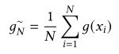

# Projet Fil Rouge - Air Liquide 
## Machine Learning Causal pour l’estimation des effets d’un traitement

  

## Pour commencer

Entrez ici les instructions pour bien débuter avec votre projet...

### Pré-requis

Ce qu'il est requis pour commencer avec votre projet...

- Programme 1
- Programme 2
- etc...

### Installation

Les étapes pour installer votre programme....

Dites ce qu'il faut faire...

_exemple_: Executez la commande ``telnet mapscii.me`` pour commencer ensuite [...]

Ensuite vous pouvez montrer ce que vous obtenez au final...

## Description du projet

Durant notre projet, on fait des études sur des données simulées dans le cadre d'un traitement binaire. Les données sont séparées en deux parties. Le premier groupe représente le groupe témoin et le deuxième correspond au groupe ayant reçu le traitement.  
Dans cette partie, on explique les différentes étapes lors de la construction du pipeline d'apprentissage automatique causal i.e. causal machine learning. Ce dernier est un outil utilisé pour mener une étude de simulation approfondie comparant les performances des différents estimateurs afin de mieux appréhender leurs applications sur des données réelles.  
On explore également l'estimation de l'effet d'un traitement pour des sous-populations d'intérêts. L'ambition est de trouver des profils types à l'aide d'une approche basée sur le clustering pour recommander le type d'intervention le plus adapté à chaque individu ou à chaque groupe d'individus.

### Pipeline du machine learning causal

    

 

La figure ci-dessus montre le schéma récapitulatif du notre pipeline. Tout d’abord, on commence par générer des données simulées. Pour cela, on produit une matrice de données X avec d colonnes et N lignes. Cette matrice représente les caractéristiques (features) des sujets étudiés, d correspond au nombre de caractéristiques de chaque individu et N est le nombre d’observations autrement dit le nombre de personnes participant à l’étude. Chaque observation i correspondant à une ligne Xi suit la loi normale.

    

 

Ensuite, on simule l’affectation du traitement selon un vecteur W de longueur N. Le i-ème élément de ce vecteur correspond à une valeur dans {0, 1} indiquant si le sujet i reçoit le traitement. Lors de ce projet, on procède de deux façons pour calculer le vecteur W. Dans le premier cas, on attribue le traitement de manière aléatoire c’est-à-dire sans prendre compte des caractéristiques de l’individu. On fixe un paramètre p appelé score de propension dont la valeur est entre 0 et 1 et on génère N valeurs avec à chaque fois une probabilité p d’avoir 1 comme le montre la formule. Dans le deuxième cas, les caractéristiques des sujets étudiés sont considérées lors de l’attribution du traitement. Le score de propension devient une fonction de X. Par conséquent, chaque individu i a une probabilité différente d’avoir le traitement.

    

 

Finalement, on simule les réponses potentielles de chaque individu au traitement. Pour cela on spécifie des fonctions mu0 et mu1 appelée les fonctions réponses, et on calcule les sorties Y selon la formule.

    

 

A l’aide des données simulées générées, on estime l'effet conditionnel moyen du traitement (CATE) et l'effet moyen du traitement (ATE) à l’aide des différents estimateurs.
Ensuite il est judicieux de mettre en place des indicateurs de qualité caractérisant la précision de chaque estimateur. Cependant l’ATE n’est pas une fonction de prédiction, c’est simplement un coeffcient réel qui mesure la magnitude d’un effet de traitement. Nous n’avons pas appris une fonction de prédiction qui pour un vecteur d’entre X renvoie une prédiction. Cela n’a donc pas de sens de calculer un critère de qualité prédictive (MSE, MAE, etc). On adopte deux méthodes pour évaluer la qualité de notre estimateur d’un effet de traitement.  
Premièrement, on calcule les intervalles de confiance sur l’ATE à partir de la version la plus simple du bootstrap. On tire un nombre m d’observations avec remise pour constituer un nouvel échantillon artificiel, puis on applique un estimateur pour estimer la valeur de l'ATE pour chaque échantillon. On répète ces deux étapes B fois et on récupère une liste contenant un nombre B de valeurs de l’ATE. A partir de ces répliques, nous pouvons construire un intervalle de confiance pour l’ATE de niveau (asymptotique) 1 − alpha.

    

 

La deuxième méthode consiste à estimer la valeur de l’ATE à partir du CATE à l’aide d’une approche Monté Carlo présentée par la formule ci-dessous. La grandeur G représente l'ATE. C'est l’espérance du CATE pouvant être calculée par une intégrale.

    

 

Ce calcul est compliqué dès lors que la dimension d de la matrix X est supérieure ou égale à 2. Or la loi des grands nombres affirme que pour un nombre très grand N on peut estimer la valeur de l'intégrale à l'aide d’une moyenne empirique illustrée par la formule ci-dessous.

    

 

### Approche basée sur le clustering

Cette approche vient après la construction du pipeline et n’est pas du tout liée à cette dernière. Chacune a un but différent. Le pipeline d’apprentissage automatique causal permet d’effectuer plusieurs tests selon différents cas d’utilisation afin de trouver les forces et faiblesses de chaque estimateur. L’objectif de cette approche par clustering est de donner les moyens d'explorer et d'interpoler les résultats obtenus sur plusieurs cas d’utilisation via le pipeline.  
En effet, la personnalisation des traitements suivant les individus est un enjeu majeur, particulièrement pour Air Liquide. Pour cela, être en mesure d’estimer l'effet de traitement moyen conditionné à une sous-population, voir à un individu est nécessaire. Un effet de traitement est dit « hétérogène » lorsqu'il affecte différemment différents individus. Par exemple, le traitement d'une politique de suivi de la recherche d'emploi peut affecter différemment les hommes que les femmes, ou les personnes vivant dans des états différents.  
Par cette approche, on cherche à détecter et caractériser avec une approche par clustering. L’objectif final est de pouvoir estimer l’ATE sur des sous-population d’intérêts. La détection de ces populations est possible via des méthodes non supervisées classiques comme le modèle de mélange gaussien (Gaussian mixture model ou GMM) ou l’algorithme k-moyennes (k-means). L’identification de ces clusters peut se faire de trois manières :
* Clustering en fonction des valeurs du CATE : on se base sur l’hétérogénéité de l'effet de traitement moyen sur une population (effet de traitement moyen conditionné à une sous
population).
* Clustering en fonction des caractéristiques des individus de la population d’intérêt (âge, genre, antécédents, etc.).
* Clustering hybride : on tient compte et des caractéristiques des individus de la population et des valeurs du CATE.

## Résultats 

Le pipeline d’apprentissage automatique causal permet d'effectuer plusieurs simulations où on considère des situations différentes pour avoir des informations sur le comportement de chaque estimateur. Ce pipeline produit deux types de sorties.  
On peut générer des graphes mettant en valeur la performance d’un estimateur sur des données
simulées en fonction du nombre d’observations. Ce graphe montre en plus l'intervalle de confiance de l’ATE. On remarque sur le graohe que plus le nombre d'observations augmente plus la largeur de l’intervalle de confiance diminue et donc l'estimation devient plus précise. On trace les résultats des estimateurs da la librairie causalml afin de les comparer aux résultats de nos estimateurs.

Le deuxième type de sortie est un fichier de type PDF contenant un tableau de résultats de tous les cas d’usage simulés. La Figure 6.2 montre un exemple de ce type de fichiers. Les colonnes du tableau représentent les estimateurs utilisés et les lignes sont les différents cas d’utilisations simulés. Chaque cellule contient le résultat de l’ATE pour une situation donnée calculé à l'aide d'un estimateur. Le calcul est répété plusieurs fois, et on fait la moyenne de toutes les valeurs calculées en précisant l’écart-type de l’ensemble des valeurs de l’ATE.  
Cet outil va servir de document de synthèse d’abord puis d’analyse en permettant aux équipes d'Air Liquide de faire plusieurs tests afin de tirer le maximum d'informations sur les estimateurs afin de mieux les utiliser sur des données réelles.

## Auteurs
Membres de l'équipe : 
* **Amal Benali** _alias_ [@AmalB](https://github.com/)
* **Fatima-Ezzahra Jait** _alias_ [@FatiJait](https://github.com/FatiJait)
* **Jean-Philippe Quach** _alias_ [@jpquach1](https://github.com/jpquach1)
* **Mohammed El yaagoubi** _alias_ [@moelyaagoubi](https://github.com/moelyaagoubi)
* **Arnaud Sangouard** _alias_ [@Arnauyd](https://github.com/Arnauyd)

Liste des encadrants :
* **Encadrants académiques** : Florence D'alche-Buc - Nathan Noiry - Yannick Guyonvarch
* **Encadrants industriels** : Habiboulaye Amadou Boubacar - Mehdi Rahim

